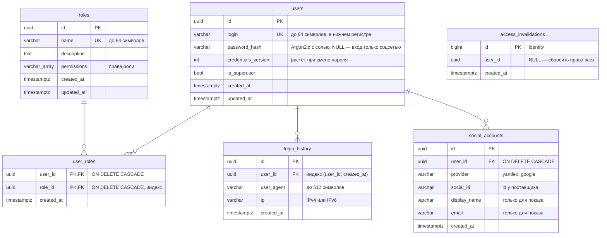
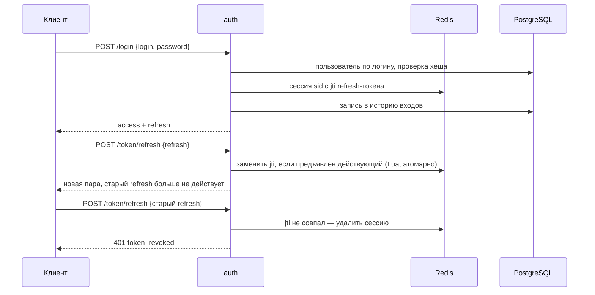

# Сервис авторизации: архитектура

Сервис регистрирует пользователей онлайн-кинотеатра, выдаёт им токены и
отвечает другим сервисам на вопрос «можно ли этому пользователю вот это».
Это отдельный сервис, а не эндпоинты в Async API: у него своя нагрузка (его
вызывают почти на каждый запрос к кинотеатру), свои требования к
безопасности и свои данные — персональные, которые не должны расползаться
по другим сервисам.

Спецификация API — [openapi.json](openapi.json) (открывается в
[editor.swagger.io](https://editor.swagger.io)); на работающем сервисе —
Swagger UI по адресу `/auth/api/openapi`.

## Компоненты

```mermaid
flowchart LR
    client[Клиент: сайт, приложение] --> nginx
    nginx -- /auth/ --> auth[auth<br/>FastAPI]
    nginx -- /api/ --> api[Async API]
    auth --> apg[(auth-postgres<br/>пользователи, роли,<br/>история входов)]
    auth --> ar[(auth-redis<br/>сессии, кеш прав)]
    api -- проверка права<br/>films.subscription --> auth
    admin[Админка каталога] -- вход сотрудника --> auth
    yandex[Яндекс, Google] -. OAuth 2.0 .-> auth
    api --> es[(Elasticsearch)]
    etl[ETL] -- фильмы с меткой<br/>access_level --> es
    etl --> pg[(PostgreSQL<br/>фильмы)]
```

| Компонент | Назначение |
|---|---|
| `auth` | FastAPI + uvicorn, без состояния: реплики масштабируются горизонтально |
| `auth-postgres` | Пользователи, роли, назначения ролей, история входов. Отдельная база, не база фильмов: персональные данные изолированы |
| `auth-redis` | Сессии (refresh-токены) и кеш прав. Без вытеснения ключей, с журналом AOF |
| `auth-migrations` | Одноразовый контейнер: `alembic upgrade head` до запуска сервиса |
| `nginx` | Общая точка входа: `/auth/` — сервис авторизации, `/api/` — Async API |

Внутри сервиса — те же слои, что в Async API:

```
auth/src/
├── main.py         # приложение, клиенты PostgreSQL и Redis, обработчики ошибок
├── cli.py          # консольные команды: createsuperuser
├── api/            # HTTP: роутеры, схемы, извлечение токена, ошибки → HTTP-статусы
├── core/           # настройки (AUTH_*), логирование
├── db/             # движок SQLAlchemy и клиент Redis
├── models/         # бизнес-сущности: пользователь, роль, права, сессия
├── services/       # бизнес-логика: токены, пароли, вход, кабинет, роли, проверка прав
└── storage/        # интерфейсы хранилищ и их реализации на PostgreSQL и Redis
```

Сервисы зависят только от интерфейсов `storage/base.py` и не импортируют
ни FastAPI, ни SQLAlchemy, ни Redis. Конкретные хранилища выбираются в одном
месте — `api/dependencies.py`. Поэтому бизнес-логика проверяется
unit-тестами на хранилищах в памяти.

## Модель доступа: RBAC

Выбрана модель на ролях (RBAC). У кинотеатра чёткие группы пользователей —
подписчики, редакторы, администраторы, — а ограничивать нужно категории
фильмов, а не отдельные поля: гибкость ABAC здесь не окупает сложность правил,
в которых легко ошибиться.

* **Право** — строка `ресурс.действие`: `films.subscription`, `access.manage`.
  Права задают сервисы-потребители, сервис авторизации их не перечисляет.
* **Роль** — именованный набор прав (`subscribers` → `films.subscription`).
  Проверяются права, а не роли: сервису контента не нужно знать, какие роли
  дают доступ к новинкам, и новая роль не требует его доработки. Так RBAC
  избегает «ролевого взрыва» в проверках.
* **Суперпользователь** — признак пользователя, а не роль: ему разрешено всё,
  проверка сразу отвечает «да». Создаётся только консольной командой
  `createsuperuser`: через API стать суперпользователем нельзя.
* **Анонимный пользователь** не обладает ни одним правом. Ему доступно всё,
  что правом не ограничено: ограничиваются только помеченные ресурсы.
* **Управлять ролями** может обладатель права `access.manage` — суперпользователь
  может выдать его роли «администраторы доступа», не делая их суперпользователями.

### Фильмы по подписке

«Фильмы, выпущенные менее трёх лет назад, — только для subscribers»:

1. ETL записывает в документ фильма метку `access_level`: `subscription`, если
   фильм вышел менее трёх лет назад (`SUBSCRIPTION_PERIOD_YEARS`), иначе `public`.
   Фильм без даты выхода — `public`.
2. Метка сама не устаревает, а фильм выходит из новинок с течением времени.
   Поэтому раз в сутки ETL переиндексирует фильмы, у которых срок новинки истёк.
3. Миграция сервиса авторизации создаёт роль `subscribers` с правом
   `films.subscription`.
4. Сервис контента для фильмов с `access_level=subscription` спрашивает
   `GET /auth/api/v1/access/check?permission=films.subscription&fresh=true`
   с токеном пользователя.

Правило «три года» живёт только в ETL, права — только в сервисе авторизации,
сервис контента знает лишь соответствие метки и права.

## Данные

### PostgreSQL, схема `auth`



* Объёмы по заданию — 500 000+ пользователей и 1 000 000+ входов. Все запросы
  идут по индексам: вход — по уникальному `login`, роли пользователя — по
  первичному ключу `user_roles`, пользователи роли — по индексу `role_id`,
  история — по `(user_id, created_at)` постранично.
* `login_history` разбита на месячные секции (RANGE по `created_at`): год
  истории удаляется отсечением секции, а не построчным `DELETE`. Ключ
  секционирования обязан входить в первичный ключ, поэтому он `(id, created_at)`.
  Подробнее — в `storage/partitions.py` и `auth/README.md`.
* `social_accounts`: уникальны пары (`provider`, `social_id`) — один аккаунт
  соцсети принадлежит одной учётной записи — и (`user_id`, `provider`): двух
  аккаунтов одной соцсети у пользователя не бывает. Объём по заданию —
  500 000+ связанных аккаунтов; оба запроса (вход и личный кабинет) идут по
  этим уникальным индексам.
* Права роли — массив в строке роли: короткий список, который всегда читается
  вместе с ролью; отдельная таблица дала бы лишний JOIN без выгоды.
* Логин приводится к нижнему регистру при каждом вводе: «Neo» и «neo» — один
  пользователь, уникальность обеспечивает обычный уникальный индекс.
* Схема создаётся миграциями Alembic (`auth/migrations`), `alembic check`
  подтверждает, что модели и миграции совпадают.

### Redis

| Ключ | Значение | Время жизни |
|---|---|---|
| `auth:session:<session_id>` | хеш: `user_id`, `refresh_jti` — id действующего refresh-токена, `credentials_version` — версия учётных данных при входе | refresh-токена, продлевается при обновлении |
| `auth:user_session_expiry:<user_id>` | сортированное множество id сессий пользователя, оценка — когда сессия истекает | самой долгой сессии пользователя |
| `auth:access:<user_id>` | права пользователя (JSON) с отметкой версии | `AUTH_ACCESS_CACHE_TTL`, 10 минут |
| `auth:access_version` | общая версия прав: растёт при изменении и удалении ролей | без срока |
| `auth:access_version:<user_id>` | версия прав пользователя: растёт при назначении и отзыве роли | 2 × время жизни кеша |
| `auth:rate:<ключ>` | попытки входа и регистрации (сортированное множество, оценка — время попытки) | окна лимита |
| `auth:oauth_state:<state>` | начатый вход через соцсеть: поставщик и кому привязать аккаунт | `AUTH_OAUTH_STATE_TTL`, 10 минут |

Redis сервиса авторизации отделён от кеша Async API: там включено вытеснение
давно не использованных ключей, а здесь вытеснение сессий разлогинило бы
пользователей. Поэтому `maxmemory-policy noeviction` и журнал AOF — сессии
переживают перезапуск.

## Токены и сессии

Вход выдаёт пару JWT, подписанных HS256 (HMAC-SHA256) ключом `AUTH_JWT_SECRET_KEY`:

| | access | refresh |
|---|---|---|
| Время жизни | 15 минут (`AUTH_ACCESS_TOKEN_TTL`) | 14 дней (`AUTH_REFRESH_TOKEN_TTL`) |
| Где хранится | нигде, только у клиента | jti — в сессии в Redis |
| Использование | многоразовый, `Authorization: Bearer` | одноразовый, `POST /token/refresh` |

Поля токена: `sub` — id пользователя, `sid` — id сессии, `jti` — id токена,
`type` — `access` или `refresh`, `iat`, `exp`. JWT подписан, но не зашифрован,
поэтому ничего секретного в нём нет.

**Сессия** — один вход на одном устройстве. access-токен действует, пока жива
его сессия: при каждом запросе сервис проверяет подпись, срок и тип токена,
наличие сессии в Redis и совпадение её версии учётных данных с версией
пользователя в PostgreSQL (выборка по первичному ключу). Так выход действует
сразу, а не через 15 минут, и при этом **активные access-токены нигде не
хранятся**.



* **Обновление пары** атомарно сравнивает и заменяет jti в Lua-скрипте: два
  одновременных запроса с одним refresh-токеном не получат две пары.
* **Повторное предъявление** уже использованного refresh-токена значит, что его
  мог перехватить злоумышленник: сессия закрывается целиком, войти заново
  придётся и владельцу, и злоумышленнику.
* **Выход** удаляет сессию: её access- и refresh-токены перестают действовать сразу.
* **«Выйти из остальных устройств»** (дополнительное задание) удаляет все сессии
  пользователя, кроме текущей, по множеству `auth:user_session_expiry:<user_id>`.
  access-токены для этого хранить не нужно: они проверяются по сессии.
* **Множество сессий пользователя не растёт.** Ключ сессии истекает сам, а его
  id в множестве — нет, поэтому множество сортированное, с оценкой «когда
  сессия истекает»: вход и обновление токенов (один Lua-скрипт) записывают
  новый срок и заодно удаляют истёкшие сессии. Число сессий ограничено
  (`AUTH_MAX_SESSIONS_PER_USER`, 20): вход сверх предела закрывает сессии,
  которые дольше всех не продлевались, — никогда не новую. Срок самого
  множества — срок самой долгой сессии: он продлевается, но не сокращается.
* **Смена пароля** закрывает остальные сессии: если пароль узнал кто-то ещё,
  он потеряет доступ. Безопасность здесь не зависит от Redis: вместе с паролем
  в той же транзакции растёт `users.credentials_version`, и сессии с прежней
  версией не проходят проверку. Удаление остальных сессий из Redis и перевод
  текущей на новую версию идут следом. Если Redis в этот момент недоступен,
  пароль всё равно сменён, чужие сессии не действуют, а войти заново (с новым
  паролем) придётся и на текущем устройстве.

## Проверка прав и кеш

Проверка нужна почти каждому запросу к кинотеатру, поэтому права пользователя
(признак суперпользователя, роли и их права) читаются из PostgreSQL одним
запросом и кладутся в Redis. Следующие проверки — один `MGET` без обращения
к базе.

Права не устаревают в кеше: назначение и отзыв роли увеличивают версию прав
пользователя, изменение и удаление роли — общую версию. Запись кеша хранит
версии, с которыми её читали из базы, и с другими версиями не выдаётся. Это
закрывает и гонку: если проверка прочитала старые права из базы, а роль
назначили до того, как она записала их в кеш, запись окажется со старой
версией и будет проигнорирована. Время жизни кеша — только страховка.

**Сбой Redis при изменении ролей.** Роль меняется в PostgreSQL, кеш лежит в
Redis — одной транзакцией их не изменить. Поэтому изменение роли в той же
транзакции записывает задание на сброс кеша (`access_invalidations`):
пользователя — при назначении и отзыве, всех — при изменении и удалении роли.

```mermaid
sequenceDiagram
    participant A as auth
    participant P as PostgreSQL
    participant R as Redis
    A->>P: BEGIN; DELETE user_roles; INSERT access_invalidations; COMMIT
    A->>P: взять задания (FOR UPDATE SKIP LOCKED)
    A->>R: сбросить кеш (версия +1)
    A->>P: удалить выполненные задания
    Note over A,R: Redis недоступен — задание остаётся в базе,<br/>ответ всё равно 204: отзыв уже зафиксирован
    loop фоновая задача каждого процесса, раз в 5 с
        A->>P: взять задания
        A->>R: сбросить кеш
        A->>P: удалить выполненные
    end
```

* Задание выполняется сразу после изменения. Если Redis недоступен, задание
  остаётся в базе и его повторяет фоновая задача (`AUTH_ACCESS_INVALIDATION_INTERVAL`,
  при сбоях пауза удваивается до `AUTH_ACCESS_INVALIDATION_MAX_INTERVAL`).
  Процессы и реплики не мешают друг другу: задания блокируются
  `FOR UPDATE SKIP LOCKED`, а удаляются только после сброса кеша.
* Повторный отзыв после сбоя отвечает 404 `role_not_assigned` — роль уже
  отобрана, а задание на сброс кеша не потеряно.
* **Где отзыв должен действовать сразу**, права проверяются по базе, минуя
  кеш: право `access.manage` на эндпоинтах управления доступом проверяется так
  всегда, а сервисы-потребители могут попросить об этом параметром
  `GET /access/check?fresh=true` (например, перед оплатой или выдачей
  платного контента). Обычная проверка идёт через кеш и после сбоя Redis
  может отвечать по-старому до ближайшего повтора — несколько секунд.

## API

Все пути — с префиксом `/auth/api/v1`. Токен — в заголовке `Authorization: Bearer <access>`.

| Метод и путь | Назначение | Доступ |
|---|---|---|
| `POST /signup` | Регистрация | все |
| `POST /login` | Вход: логин и пароль → пара токенов, запись в историю | все |
| `POST /token/refresh` | Обновление пары токенов | refresh-токен |
| `POST /logout` | Выход из текущей сессии | access-токен |
| `POST /logout/others` | Выход из всех сессий, кроме текущей | access-токен |
| `GET /users/me` | Данные пользователя и его роли | access-токен |
| `PATCH /users/me/login` | Смена логина, подтверждается паролем | access-токен |
| `PUT /users/me/password` | Смена пароля, закрывает остальные сессии | access-токен |
| `GET /users/me/login-history` | История входов, постранично | access-токен |
| `GET /roles` · `POST /roles` | Список ролей · создание | `access.manage` |
| `GET` · `PATCH` · `DELETE /roles/{role_id}` | Роль · изменение · удаление | `access.manage` |
| `GET /users/{user_id}/roles` | Роли пользователя | `access.manage` |
| `PUT` · `DELETE /users/{user_id}/roles/{role_id}` | Назначить · отобрать роль | `access.manage` |
| `GET /access/check?permission=…[&fresh=true]` | Есть ли у пользователя право (`fresh` — по базе, минуя кеш) | все, токен необязателен |

Логин и пароль передаются только в теле запроса: строка запроса попадает в
журналы nginx и балансировщиков. Изменяющие операции не принимают GET.

## Обработка ошибок

Тело ошибки — `{"code": "...", "detail": "..."}`: по `code` клиент решает, что
делать, `detail` — для людей. У каждого эндпоинта в OpenAPI перечислены его
коды ошибок с примерами.

| Статус | code | Когда | Что делать клиенту |
|---|---|---|---|
| 401 | `not_authenticated` | токен не передан или не в схеме Bearer | передать токен |
| 401 | `token_expired` | подпись верна, срок истёк | обновить пару токенов |
| 401 | `token_invalid` | неверная подпись, повреждённый токен, refresh вместо access и наоборот | войти заново |
| 401 | `token_revoked` | сессия закрыта: выход, выход из других устройств, смена пароля, повторный refresh, пользователь удалён | войти заново |
| 401 | `invalid_credentials` | неверный логин или пароль при входе | исправить ввод |
| 403 | `permission_denied` | нет права `access.manage` | — |
| 403 | `wrong_password` | неверный текущий пароль при смене логина или пароля | исправить ввод |
| 404 | `user_not_found`, `role_not_found`, `role_not_assigned` | нет пользователя, роли или назначения | — |
| 409 | `login_taken`, `role_name_taken` | логин или имя роли заняты | выбрать другое |
| 422 | — | запрос не прошёл проверку, формат FastAPI | исправить запрос |
| 429 | `too_many_requests` | исчерпан лимит попыток входа или регистрации | повторить через `Retry-After` секунд |
| 503 | `service_unavailable` | PostgreSQL или Redis недоступны | повторить позже |

Ответы на вопросы из задания:

* **Истёкший токен** — 401 `token_expired`: подпись верна, клиенту достаточно
  обновить пару токенов refresh-токеном.
* **Токен с неверной подписью** — ответ отличается: 401 `token_invalid`. Токен
  подделан или повреждён, обновлять его бессмысленно — только войти заново.
  Подпись проверяется раньше срока: поддельный токен с истёкшим сроком тоже
  получит `token_invalid`, а не подсказку «обновите токен».
* **Логин занят** — 409 `login_taken`, и при регистрации, и при смене логина.
* **Неверный логин и неверный пароль** при входе неразличимы — оба 401
  `invalid_credentials`, и отвечают за одинаковое время (для неизвестного
  логина пароль сверяется с хешем-заглушкой): по ответу нельзя узнать,
  зарегистрирован ли логин.

На 401 сервис отдаёт заголовок `WWW-Authenticate` по RFC 6750, для
недействительного токена — с `error="invalid_token"` и причиной. Ответ 422 не
содержит присланных значений (FastAPI возвращает их в поле `input`, а это мог
быть пароль).

## Безопасность

* Пароли — Argon2id (KDF, намеренно медленная и требовательная к памяти) со
  своей солью на каждый хеш; хеширование — в пуле потоков, чтобы не
  останавливать цикл событий.
* Алгоритм подписи JWT задан явно: токены с `alg=none` или чужим алгоритмом не
  принимаются. Ключ подписи — не короче 32 символов, без значения по умолчанию.
* Секреты (`AUTH_JWT_SECRET_KEY`, `AUTH_POSTGRES_PASSWORD`) только из окружения:
  без них сервис и docker-compose не запускаются.
* Смена логина и пароля подтверждается текущим паролем: одного украденного
  access-токена для захвата аккаунта мало.
* База сервиса отделена от базы фильмов и наружу не открыта.

### Ограничение частоты проверок пароля

Вход, регистрация и подтверждение пароля в личном кабинете считают Argon2 —
это десятки миллисекунд процессора и десятки мегабайт памяти на запрос, в том
числе для несуществующего логина (сверка с хешем-заглушкой). Без ограничений
через них перебирают пароли и нагружают сервис. Поэтому попытка засчитывается
**до** проверки пароля, и сверх лимита Argon2 не выполняется вовсе: ответ —
429 `too_many_requests` с заголовком `Retry-After`.

| Лимит | По умолчанию | Против чего |
|---|---|---|
| Вход с одного IP | 20 попыток в минуту | перебор с одного адреса по разным логинам |
| Вход в один логин | 10 неудачных попыток за 15 минут | перебор пароля одного аккаунта с разных адресов |
| Регистрация с одного IP | 10 в час | массовая регистрация, нагрузка хешированием |
| Проверка пароля в кабинете, учётная запись | 5 неудачных за 15 минут | перебор пароля с украденным токеном в обход лимитов входа |
| Проверка пароля в кабинете, IP | 20 за 15 минут | тот же перебор с разных аккаунтов и нагрузка хешированием |

Кабинет считается отдельно от входа и по учётной записи, а не по логину: в
кабинете логин не предъявляют, а сам он в это время может меняться. Смена
логина и смена пароля делят один счётчик — иначе пароль перебирали бы по
очереди в двух местах. Верный пароль его обнуляет, как и успешный вход.

* Счётчики общие для всех процессов и реплик — в Redis. Окно **скользящее**
  (сортированное множество с временем попыток): на стыке минут лимит не
  удваивается, как у счётчика «за текущую минуту».
* Проверка всех лимитов и учёт попытки — один Lua-скрипт: параллельные запросы
  не проскочат лимит, а отклонённая попытка не засчитывается ни в один счётчик.
* Успешный вход обнуляет счётчик логина: у владельца копятся только неудачные
  попытки, а злоумышленник, не зная пароля, обнулить счётчик не может. Лимит IP
  мягче лимита логина: с одного адреса (NAT, офис) входят разные люди.
* Адрес клиента за nginx uvicorn берёт из `X-Forwarded-For`, и nginx этот
  заголовок **перезаписывает** адресом клиента: подставить чужой IP нельзя.
* Первый рубеж — `limit_req` в nginx на `/login`, `/signup` и эндпоинты смены
  логина и пароля (5 запросов в секунду с адреса, всплеск до 10): поток
  запросов отсекается, не доходя до сервиса. Ответ nginx — в том же формате
  `{"code", "detail"}`.

## Отказоустойчивость и нагрузка

* Сервис без состояния: всё состояние в PostgreSQL и Redis, реплик может быть
  сколько угодно (`AUTH_WORKERS` процессов в контейнере, контейнеров — сколько
  нужно за nginx).
* Без Redis нельзя проверить сессию, без PostgreSQL — войти и сверить версию
  учётных данных, поэтому при их недоступности сервис отвечает 503 и пишет
  причину в журнал. Обрыв соединения
  с Redis повторяется с короткой экспоненциальной паузой (до 0,5 с), таймаут не
  повторяется. Соединения PostgreSQL проверяются перед выдачей из пула.
* Проверка токена — локальная проверка подписи, один запрос к Redis (сессия) и
  один к PostgreSQL (версия учётных данных, по первичному ключу); проверка
  права — ещё один запрос к Redis, база нужна только при промахе кеша.
* Миграции применяет отдельный одноразовый контейнер: реплики сервиса не
  применяют их наперегонки.

## Вход через соцсети

Сервис — **потребитель** OAuth 2.0, а не сервер: своего OAuth-сервера нет.
Реализован Authorization Code Flow, поставщики (Яндекс, Google) описаны
данными в `storage/oauth.py`, обмен ведёт Authlib.

Решения, которые стоит помнить:

* **Код, а не токен.** Поставщик возвращает одноразовый код, а меняет его на
  токен бэкенд, где лежит `client_secret`. Перехваченный код без секрета
  бесполезен; Implicit Flow, отдающий токен в адресной строке, не используется.
* **state одноразовый и помнит цель.** Он связывает переход к поставщику с
  возвратом (защита от CSRF) и хранит, к кому привязывать аккаунт. Решение
  «войти или привязать» принимается в начале входа: прими его на возврате,
  чужой ответ поставщика привязался бы к тому, кто в этот момент просто вошёл
  на сайт. Хранится в Redis, читается через `GETDEL` — повторный возврат с тем
  же значением не сработает даже при одновременных запросах.
* **Опознание по (provider, social_id).** По email искать нельзя: его меняют и
  не всегда подтверждают, и тогда чужой аккаунт открыл бы доступ к чужой
  учётной записи.
* **Учётная запись без пароля.** `users.password_hash` стал необязательным.
  Вход по паролю в такую запись невозможен, и время ответа её не выдаёт:
  пароль сверяется с заглушкой, как для несуществующего логина. Открепить
  последний способ войти нельзя — иначе владелец потерял бы доступ. Считает
  оставшиеся способы и удаляет связь одна операция хранилища с блокировкой
  строки пользователя: параллельные открепления идут по очереди и не снимают
  две последние соцсети разом.
* **Привязку завершает тот же вход, который её начал.** Вместе со `state`
  запоминается сессия и версия учётных данных; перед привязкой сервис
  убеждается, что сессия жива, а версия не изменилась, — иначе 401
  `social_link_expired`. Смена пароля владельцем отменяет привязку, начатую
  украденным токеном: иначе злоумышленник завёл бы себе способ входить снова.
* **Вход открывает обычную сессию.** `AuthService.open_session` общий для
  входа по паролю и через соцсеть: дальше всё работает одинаково — refresh,
  выход, история входов, версия учётных данных.

## Потребители сервиса

**Админка каталога** ([admin_panel](../../admin_panel/README.md)) — первый
сервис, который аутентифицирует людей через этот. Её бэкенд аутентификации
обменивает логин и пароль сотрудника на пару токенов (`POST /login`), читает
профиль (`GET /users/me`) и проверяет право `admin.access` по базе
(`GET /access/check?permission=admin.access&fresh=true`). Право даёт роль
`staff` (миграция `0005`).

Обмен получился таким, потому что сервис на вход отдаёт токены, а не профиль:
кто вошёл, потребитель узнаёт отдельным запросом. Проверка права идёт мимо
кеша: снятая роль должна закрывать админку сразу, а не через время жизни кеша.

Сессия сотрудника в сервисе после входа **не закрывается**: сессия Django
живёт долго, и без неё отозванное право действовало бы до конца рабочего дня.
Админка раз в минуту предъявляет токен снова — обновляя пару по
`POST /token/refresh`, когда access-токен истёк, — и по ответу решает, пускать
ли дальше. Поэтому админку закрывают и смена пароля, и «выйти из остальных
сессий»: обе закрывают сессию, а `refresh` на закрытую отвечает 401.
Выход из админки закрывает сессию сам (`POST /logout`).

**Async API** (каталог) спрашивает право `films.subscription` на фильмы, которые
ETL пометил `access_level=subscription`:
`GET /access/check?permission=films.subscription&fresh=true` с токеном
пользователя. Анонимный запрос в сервис не идёт вовсе — прав у анонима нет,
и это снимает с сервиса всю анонимную нагрузку каталога.

Токен там не разбирается на месте, хотя подпись проверить дешевле: наш
access-токен действует, пока жива сессия, поэтому подпись не говорит ни о
закрытой сессии, ни о смене пароля, ни об отозванной подписке. Кеша прав на
стороне каталога тоже нет — он вернул бы ту задержку отзыва, ради которой
стоит `fresh=true`.

**Устойчивость — обязанность потребителя.** Сервис авторизации самый
нагруженный на сайте, и его отказ не должен ронять остальные. У обоих
потребителей поэтому одинаковый набор: явные таймауты, повтор только обрыва
соединения (таймаут ответа не повторяется — сервис уже занят запросом),
прерыватель после серии сбоев. Дальше они расходятся, потому что разной ценой
даётся отказ:

| Потребитель | Без ответа сервиса |
|---|---|
| Async API | Выдача деградирует до публичных фильмов; карточка подписочного фильма — 503, а не 403: подписку не подтвердить, но и отказывать в ней неверно |
| Админка | Вход отклоняется с обычной ошибкой формы; уже вошедшие работают дальше, но не дольше пяти минут — столько админка доверяет прошлой проверке доступа. На долгий простой есть аварийный локальный суперпользователь |

## Наблюдаемость

Сервис не отвечает на вопрос «почему запрос шёл две секунды» в одиночку: время
могло уйти в PostgreSQL, в Redis, к поставщику OAuth или в соседний сервис.
Поэтому у запроса есть сквозной идентификатор и трассировка.

* **`X-Request-Id`** выдаёт nginx и перезаписывает им присланный клиентом.
  Идентификатор идёт в access-лог nginx, в записи журнала каждого сервиса, в
  тег спана `http.request_id` и в ответ клиенту, а каждый сервис передаёт его
  дальше, в исходящие вызовы. Запрос без него отклоняется: он пришёл мимо
  шлюза, и собрать его историю было бы нечем.
* **Спаны** уходят в Jaeger по OTLP. Запросы сервиса контента к этому сервису
  инструментированы и уносят контекст заголовком `traceparent`, поэтому в
  Jaeger виден не список независимых спанов, а дерево: запрос к каталогу и
  вложенная в него проверка права.
* Идентификатор хранится в контекстной переменной: она своя у каждой задачи
  asyncio, поэтому одновременные запросы не перепутают идентификаторы, а
  функции в глубине не приходится тащить его параметром.

## Дальше

Спринт 7, осталось: общее ограничение частоты запросов к сервису — сейчас
лимиты стоят только на вход и регистрацию.
