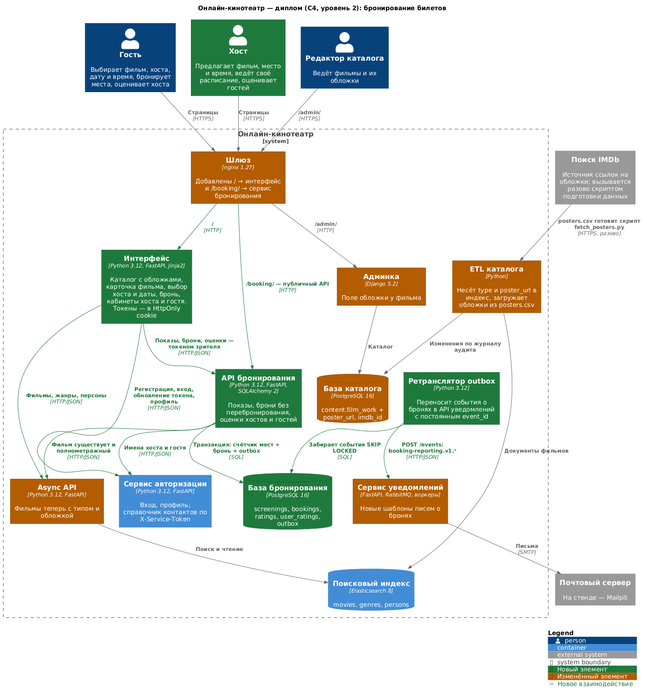
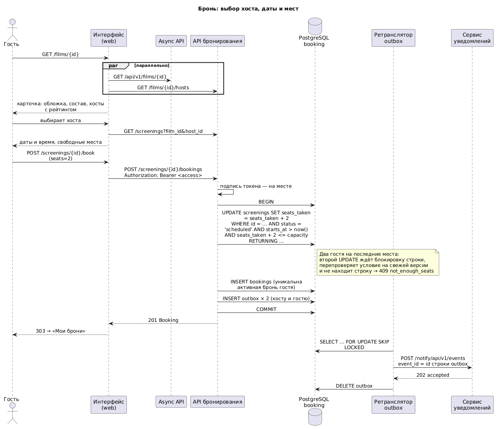

# Диплом «Бронирование билетов»: архитектура

Требования — [requirements.md](requirements.md), план — [planning.md](planning.md),
исследование и выбор стека — [research.md](research.md).

| Схема | Исходник | Картинка |
|---|---|---|
| Система после диплома (C4, уровень 2) | [c4-container-diploma.puml](../architecture/c4-container-diploma.puml) | [c4-container-diploma.png](../architecture/c4-container-diploma.png) |
| Путь брони: от кнопки до письма | [booking-flow.puml](../architecture/booking-flow.puml) | [booking-flow.png](../architecture/booking-flow.png) |



## Что есть и что меняется

Диплом строится поверх кинотеатра пяти модулей — он целиком в этом
репозитории. Новое и изменённое:

| Компонент | Что это | Статус |
|---|---|---|
| **Сервис бронирования** `booking/` | FastAPI + SQLAlchemy 2 + PostgreSQL 16: показы, брони, оценки; outbox → уведомления | новый |
| **Интерфейс** `web/` | FastAPI + Jinja2: каталог, карточка фильма, бронирование, кабинет хоста и гостя | новый |
| ETL каталога `etl/` | Переносит в индекс тип, обложку и данные Кинопоиска; скрипты обложек и Кинопоиска | изменён |
| Async API `src/` | Отдаёт `type` и `poster_url`, фильтр по типу | изменён |
| Админка `admin_panel/` | Поле обложки, данные Кинопоиска; раздаёт картинки `/posters/<id>.jpg` | изменён |
| Сервис уведомлений `notifications/` | Шаблоны писем о бронях | изменён |
| nginx | `/` → интерфейс, `/booking/` → сервис бронирования | изменён |
| Сервис авторизации | Не меняется: вход, профиль, справочник контактов | как есть |

Сервисы UGC (сбор событий, Kafka, ClickHouse, контент на MongoDB) диплом не
использует, и по решению заказчика они убраны из репозитория и стека: стенд
стал легче на семь контейнеров. Их история — в git и в репозитории модуля 4.

## Компоненты

### Интерфейс (`web`)

Серверный рендеринг страниц — BFF (backend for frontend). Браузер ходит только
в него; он сам, параллельно, ходит во внутренние API: Async API за фильмами,
сервис бронирования за показами, сервис авторизации за входом.

* Токены сервиса авторизации лежат в cookie `HttpOnly`, `SameSite=Lax`:
  JavaScript их не видит, а форма с чужого сайта не отправит их POST-запросом.
  Истёкший access-токен интерфейс сам обновляет по refresh-токену.
* Все изменения — формы POST с редиректом (PRG): обновление страницы не
  повторяет бронь.
* Ошибки сервисов показываются человеку по их машиночитаемому коду
  (`not_enough_seats` → «Осталось только 2 места»), а не как «ошибка 409».
* JavaScript — только для удобства (переключатель хостов в карточке без
  перезагрузки); без него всё работает ссылками и формами.

### Сервис бронирования (`booking`)

Тот же каркас, что у сервисов авторизации и уведомлений: слои `api` · `core` ·
`db` · `models` · `services` · `storage`, бизнес-логика зависит от интерфейсов
хранилищ (`storage/base.py`), конкретные реализации выбираются в
`api/dependencies.py`.

Процессы из одного образа:

* `booking-api` — HTTP API;
* `booking-relay` — ретранслятор outbox: переносит события о бронях в API
  уведомлений.

Внешние зависимости и что будет при их отказе:

| Зависимость | Зачем | При отказе |
|---|---|---|
| PostgreSQL `booking-postgres` | Показы, брони, оценки, outbox | 503 |
| Async API | Проверить, что фильм есть и он полнометражный; снять название и обложку | создать показ нельзя (503), остальное работает |
| Сервис авторизации, справочник контактов | Имя хоста и гостя для страниц | показ и бронь создаются, имя дописывается «Зритель» |
| API уведомлений | Письма участникам | письма ждут в outbox и уходят позже |
| Токен доступа | Кто прислал запрос | проверяется на месте подписью, без сетевого вызова |

## Модель данных (схема `booking`)

```
screenings                              bookings
──────────                              ────────
id            uuid PK                   id            uuid PK
host_id       uuid                      screening_id  uuid FK → screenings
host_name     varchar(128)              guest_id      uuid
film_id       uuid                      guest_name    varchar(128)
film_title    varchar(255)              seats         smallint  1..10
film_poster   varchar(512) null         status        active | cancelled
starts_at     timestamptz               created_at, updated_at
place         varchar(255)              UNIQUE (screening_id, guest_id)
address       varchar(512)                     WHERE status = 'active'
description   text null
capacity      smallint  1..50           ratings
seats_taken   smallint                  ───────
status        scheduled | cancelled     id, screening_id FK, author_id,
created_at, updated_at                  target_id, target_role (host | guest),
CHECK (0 <= seats_taken <= capacity)    score 1..5, comment, created_at
                                        UNIQUE (screening_id, author_id, target_id)
user_ratings
────────────                            outbox
user_id, role  PK                       ──────
score_sum, votes                        id (= event_id), payload jsonb,
                                        available_at, attempts, last_error,
                                        locked_until, created_at
```

Индексы под запросы страниц:

* `screenings (film_id, starts_at) WHERE status = 'scheduled'` — хосты фильма
  и их ближайшие показы (карточка фильма, 300 запросов/с в пике);
* `screenings (host_id, starts_at)` — расписание хоста;
* `bookings (guest_id, created_at)` — брони гостя.

## API сервиса бронирования

Префикс `/booking/api/v1`, документация — `/booking/api/openapi`. Ошибки —
`{"code": "...", "detail": "..."}`.

| Метод и путь | Кто | Что делает |
|---|---|---|
| `GET /films/{film_id}/hosts` | все | Хосты фильма: имя, рейтинг, ближайший показ, число показов |
| `GET /screenings?film_id=&host_id=` | все | Будущие показы с фильтрами, по времени начала |
| `GET /screenings/{id}` | все | Показ: свободные места, место, хост |
| `POST /screenings` | вошедший | Создать показ (стать хостом) |
| `PATCH /screenings/{id}` | хост | Изменить место, время, описание, число мест |
| `POST /screenings/{id}/cancel` | хост | Отменить показ и все брони |
| `GET /screenings/{id}/bookings` | хост | Гости показа с их рейтингом |
| `POST /screenings/{id}/bookings` | вошедший | Забронировать места |
| `PATCH /bookings/{id}` | гость | Изменить число мест |
| `POST /bookings/{id}/cancel` | гость | Отменить бронь |
| `GET /me/screenings?period=` | вошедший | Расписание хоста: будущие или прошедшие |
| `GET /me/bookings?period=` | вошедший | Брони гостя |
| `POST /screenings/{id}/ratings` | участник | Оценить хоста или гостя |
| `GET /screenings/{id}/ratings/mine` | участник | Кого я уже оценил на этом показе |
| `GET /users/{id}/rating` | все | Рейтинг зрителя как хоста и как гостя |
| `GET /users/{id}/reviews?role=` | все | Оценки с комментариями, полученные зрителем |

## Главный сценарий: бронь без перебронирования



Бронь — **одна транзакция** из трёх шагов:

1. Условный `UPDATE` счётчика мест:

   ```sql
   UPDATE booking.screenings
      SET seats_taken = seats_taken + :seats
    WHERE id = :id AND status = 'scheduled' AND starts_at > now()
      AND seats_taken + :seats <= capacity
   RETURNING ...
   ```

   PostgreSQL берёт блокировку строки на `UPDATE` и после ожидания заново
   проверяет условие на свежей версии строки (EvalPlanQual). Поэтому два
   одновременных запроса на последние места не пройдут оба — второй увидит уже
   увеличенный `seats_taken`. Не прошла ни одна строка — причину (нет показа,
   отменён, начался, мест мало) сервис уточняет отдельным чтением, чтобы
   ответить правильным кодом.
2. `INSERT` брони. Частичный уникальный индекс не даёт гостю вторую активную
   бронь на тот же показ; нарушение откатывает и шаг 1.
3. `INSERT` в outbox событий для хоста и гостя.

Последний рубеж — `CHECK (seats_taken <= capacity)`: даже ошибка в коде не
запишет перебронирование.

## ADR

Нумерация продолжает ADR модулей 4–5 (последний — ADR-18 в
`docs/architecture/notifications.md`).

### ADR-19. Бронирование — отдельный сервис

**Контекст.** Показы и брони можно было положить в Async API (рядом с
фильмами), в сервис пользовательского контента (это тоже «контент от
зрителя») или завести отдельный сервис.

**Решение.** Отдельный сервис со своей базой.

**Почему.** Async API — read-only витрина над Elasticsearch, транзакций у него
нет, и запись туда сломала бы его модель кеширования. Сервис контента (модуль 4) жил на
MongoDB, а гарантия «не продать лишнее место» естественно выражается
транзакцией и ограничением реляционной базы. У брони свой жизненный цикл, свой
профиль нагрузки (мало записи, острая конкуренция) и своя цена ошибки — значит,
и своя граница.

**Последствия.** Ещё одна база и ещё один процесс в стеке; связь с каталогом
по `film_id` без внешнего ключа — фильм проверяется через Async API при
создании показа.

### ADR-20. Хранилище — PostgreSQL

**Контекст.** Записей мало (≈7 млн строк за три года), запросы — по ключу и
диапазону времени, нужна атомарность «счётчик мест + бронь + событие».

**Решение.** PostgreSQL 16, та же версия, что у остальных баз стека.

**Почему.** Транзакции, `CHECK`, частичные уникальные индексы и блокировки
строк — ровно те средства, которыми выражаются инварианты брони. MongoDB
(сервис контента) умеет транзакции только на наборе реплик и не имеет
`CHECK` по двум полям; Redis держал бы счётчик, но брони и оценки всё равно
нужно хранить надёжно. Сравнение — в [research.md](research.md).

### ADR-21. Защита от перебронирования — условный UPDATE счётчика

**Контекст.** Варианты: проверить остаток `SELECT`-ом и вставить бронь;
`SELECT … FOR UPDATE` строки показа; уровень `SERIALIZABLE`; атомарный
условный `UPDATE` счётчика; распределённая блокировка в Redis.

**Решение.** Условный `UPDATE … WHERE seats_taken + n <= capacity` плюс
`CHECK` в таблице.

**Почему.** Исследование под конкуренцией (200 одновременных броней на 10
мест, [research.md](research.md)): проверка `SELECT`-ом перебронирует; `FOR
UPDATE` и условный `UPDATE` корректны, но `UPDATE` — один запрос вместо двух и
короче держит блокировку; `SERIALIZABLE` корректен, но отвечает ошибками
сериализации, которые надо повторять. Redis добавил бы второе хранилище и
рассинхронизацию с базой.

### ADR-22. Название фильма и имя хоста — снимком в показе

**Контекст.** Страницы «мои брони», «расписание хоста», «хосты фильма» должны
показывать название фильма, обложку и имена. Брать их на чтении — это поход в
Async API и сервис авторизации на каждую строку списка.

**Решение.** Снимок при создании: `film_title`, `film_poster`, `host_name`,
`guest_name` лежат в строках показа и брони.

**Почему.** Предел 300 мс на страницу. Название фильма и имя меняются редко,
а у показа есть «паспорт» на момент создания — как у билета, где напечатано
название сеанса.

**Последствия.** Переименование фильма в каталоге не обновит старые показы;
для учебного кинотеатра это приемлемо, при необходимости — фоновое обновление
по событию ETL.

### ADR-23. Письма — через outbox сервиса бронирования и HTTP API уведомлений

**Контекст.** О брони должны узнать хост и гость. Можно публиковать прямо в
RabbitMQ сервиса уведомлений или вызывать его API.

**Решение.** События пишутся в outbox той же транзакцией, что и бронь;
`booking-relay` отправляет их в `POST /notify/api/v1/events` с `event_id` =
идентификатор строки outbox.

**Почему.** Очереди RabbitMQ — внутреннее устройство сервиса уведомлений
(ADR-17), их формат может меняться; контракт — его API. Outbox делает
отправку независимой от доступности уведомлений (НФТ-4), а постоянный
`event_id` гасит повтор на стороне уведомлений (НФТ-6).

### ADR-24. Интерфейс — серверный рендеринг на FastAPI и Jinja2

**Контекст.** Нужен интерфейс: каталог с обложками, карточка фильма,
бронирование. Варианты — SPA (React/Vue) или серверные страницы.

**Решение.** Отдельный сервис `web` на FastAPI + Jinja2, BFF.

**Почему.** Курс — про Python-бэкенд: тот же стек, те же тесты, тот же CI.
Серверные страницы дают ссылочную навигацию (требование к диплому «переходы
по страницам происходят по ссылкам») и держат токены в `HttpOnly` cookie, а
не в `localStorage`. Параллельные походы в API на сервере укладываются в
300 мс лучше, чем каскад запросов из браузера.

**Последствия.** Интерактивность скромнее SPA; для бронирования этого
достаточно.

### ADR-25. Обложки и данные Кинопоиска — в базе каталога

**Контекст.** В дампе каталога 999 фильмов без обложек, без идентификаторов
IMDb и без русских названий и описаний. Нужна обложка у каждой карточки, а
кинотеатр русскоязычный.

**Решение.** Всё, что найдено снаружи, лежит в базе каталога (схема
`content`), а не ссылками на чужие сайты:

* `film_work.poster_url`, `imdb_id` — ссылка-источник обложки (поиск IMDb,
  `etl/scripts/fetch_posters.py` → `etl/data/posters.csv`, ETL загружает при
  старте); её правит редактор в админке;
* `film_kinopoisk` — что нашёл Кинопоиск (`etl/scripts/fetch_kinopoisk.py`):
  русское название и описание, год, рейтинг, страны, жанры и полный ответ API
  в `jsonb`; строка есть и у ненайденного фильма — суточный лимит ключа
  (500 запросов) не тратится на него повторно;
* `film_poster` — **сами картинки** (`bytea`, `etl/scripts/fetch_poster_images.py`):
  с Кинопоиска, а если там нет — по ссылке каталога.

ETL пишет в индекс адрес `/posters/<id>.jpg`, если картинка загружена, иначе —
ссылку. Картинки отдаёт админка (единственный, кроме ETL, у кого есть база
каталога), nginx кеширует ответы на сутки. Русские название и описание
доезжают через индекс до Async API — по ним работает поиск — и до интерфейса.

**Почему.** Картинка в своей базе не зависит от того, жив ли чужой CDN и
пускает ли он к себе; страница не ходит в три чужих домена. Сопоставление по
названию строгое (точное совпадение, тот же тип, неоднозначные названия
пропускаются): чужая обложка или чужое описание хуже заглушки. Скрипты
отделены от запуска стека: стенд поднимается без интернета и без ключа.

**Последствия.** База каталога выросла на ~25 МБ картинок. Данные Кинопоиска
получены ключом заказчика; это чужие тексты и изображения, поэтому в
репозиторий они не попадают — живут только в базе стенда и собираются
скриптами заново.

### ADR-26. Оценки — после показа, только участникам, агрегат счётчиком

**Контекст.** Задание со звёздочкой — оценки хоста и гостя. Рейтинг хоста
показывается в карточке каждого фильма.

**Решение.** Оценка от 1 до 5 доступна после начала показа, только между его
участниками (гость с активной бронью ↔ хост), одна на пару. Средний рейтинг
хранится готовым счётчиком `user_ratings (score_sum, votes)` и двигается той же
транзакцией, что и оценка.

**Почему.** Ограничение участниками отсекает накрутку посторонними; счётчик
вместо `AVG()` на чтении — тот же урок, что в сервисе контента (ADR-7):
агрегат на горячем пути считается заранее.
